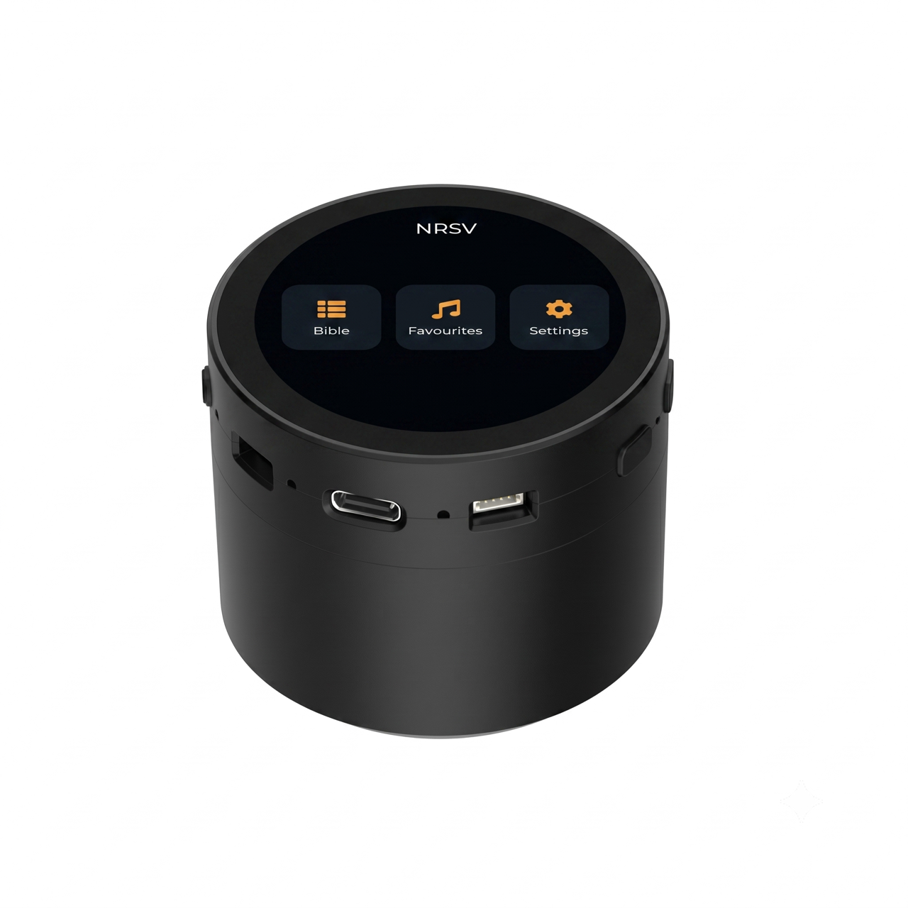
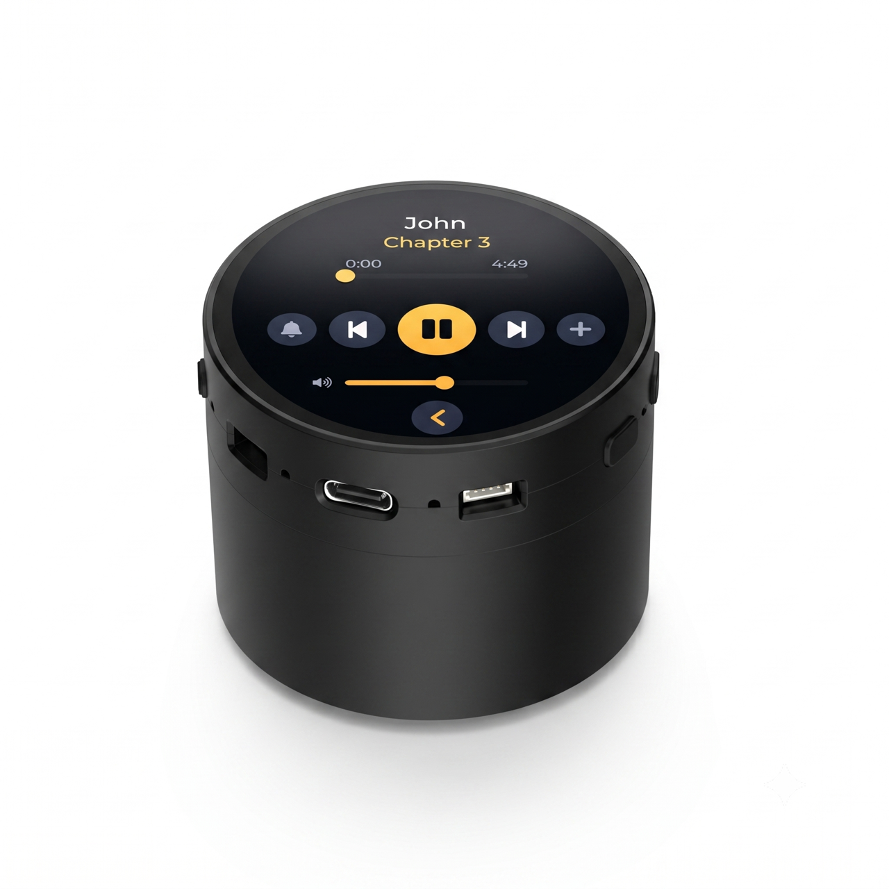
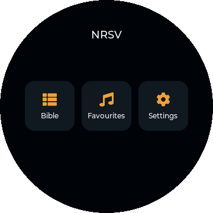
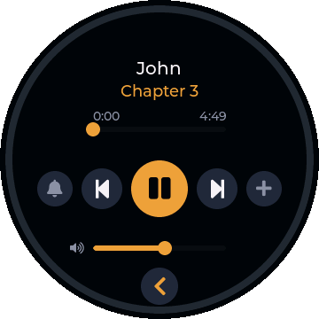
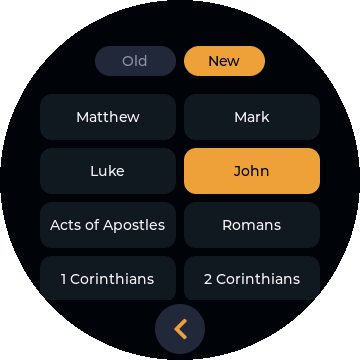
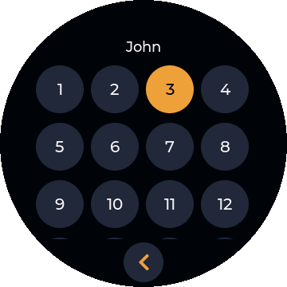
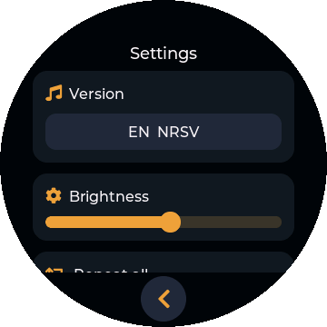
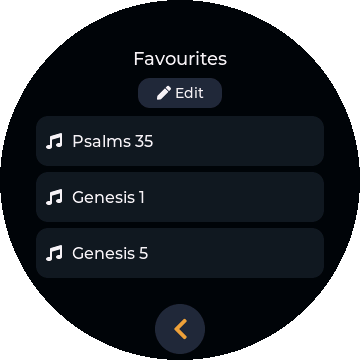

# Shema — ESP32-S3 Audio Bible Player

<p align="center">
  
  &nbsp;
  
</p>

**Shema** (שְׁמַע — Hebrew for *"Hear,"* from "Hear, O Israel," Deut 6:4) is a
small, offline, battery-powered **audio Bible player** built on the
**Waveshare ESP32-S3-Touch-LCD-1.85C (V2)** — a 360×360 round touchscreen.
It plays MP3 Scripture straight from a microSD card, with a round-native touch
UI, sleep timer, multiple versions/languages, and ~10 hours of playback per
charge. No WiFi, no accounts, no internet — just press play.

> **Build your own.** This repository is open source so anyone can flash a board
> and make a player. For non-technical users there's a **one-click web installer**
> (no software to install) — see [Flash it](#flash-it-easiest) below.

---

## Screenshots

<p align="center">
  
  
  
</p>
<p align="center">
  
  
  
</p>

---

## Flash it (easiest)

This installs the firmware straight from your **web browser** — nothing to
download or install. It works on **Windows, Mac, Linux, and Chromebook** using
**Google Chrome** or **Microsoft Edge** (Firefox and Safari can't talk to USB
devices).

**Step by step:**

1. On a computer, open the **web installer**:
   **<https://holystack.dev/shema/flash>**
2. Connect the device to the computer with a **USB-C data cable**
   — a *charge-only* cable will not work.
3. Click **Connect & Install**.
4. A small window lists serial ports. Pick the device's port (often shown as
   *USB JTAG/serial debug unit* or *USB Serial*) and click **Connect**.
5. Click **Install** and confirm. Flashing takes about a minute — **don't unplug.**
6. When it reports success, unplug. The player boots on its own. 🎉

> **iPhone/iPad cannot flash USB devices at all** — that's an Apple platform
> limitation, not a bug with this tool. Use a computer.

**If it won't connect**, put the board into **download mode** by hand: hold the
**BOOT** button, tap **RESET**, release **BOOT**, then click **Connect** again.

| Problem | Fix |
|---------|-----|
| Device not in the port list | Use a **data** USB-C cable (not charge-only); try another port/cable; enter download mode (above). |
| "Web Serial not supported" | Use **Chrome** or **Edge** on a **computer** — not a phone, not Safari/Firefox. |
| Flashing fails partway | Different cable/port, then enter download mode and retry. |
| Blank screen after flashing | Tap **RESET** once; make sure a microSD card with audio is inserted. |

> **Prefer the command line?** See [Build it yourself](#build-it-yourself-developers)
> to build from source and flash with `idf.py`, or flash a prebuilt
> `firmware.bin` from the [Releases](https://github.com/holystack-dev/shema/releases)
> page with `esptool`.

---

## What you need (hardware)

The **1.85C BOX + battery (SKU 30684)** ships as a complete unit — the round
360×360 touchscreen, the speaker box (enclosure + 4 Ω speaker), and the 3.7 V
battery are all included. You only need to add:

| Part | Notes |
|------|-------|
| **microSD card (FAT32)** | Holds the audio. 8–32 GB is plenty. |
| **USB-C data cable** | For flashing and charging — must be a **data** cable, not charge-only. |

### Where to buy the board

This firmware targets the **`1.85C`, V2** — the round model that comes in a
**speaker box**. Get the **BOX + battery bundle (SKU 30684)**: it includes the
enclosure, speaker, and battery, so it arrives ready to use. (V1 is discontinued,
replaced by V2 from January 2026.)

Variants you may see when ordering:

- **SKU 30684** — BOX **+ battery** (recommended; everything included)
- **SKU 30685** — BOX (speaker box, no battery)
- **SKU 30683** — bare board only (no box, no battery)

Where to get it:

- **Waveshare (official):** <https://www.waveshare.com/esp32-s3-touch-lcd-1.85c.htm?sku=30684> · SKU **30684**
- **Amazon:** search *"Waveshare ESP32-S3 1.85inch Round LCD Speaker Box"*
- **AliExpress / OpenELAB / local Waveshare resellers** also carry it.
- **Datasheet & wiki:** <https://docs.waveshare.com/ESP32-S3-Touch-LCD-1.85C>

Typical price is roughly **US $30–50**, depending on variant and seller.

> **Key board facts** (from the [Waveshare docs](https://docs.waveshare.com/ESP32-S3-Touch-LCD-1.85C)):
> 1.85″ **360×360** round LCD, capacitive touch (I²C), **USB-C** for power +
> flashing, **BOOT** & **RESET** buttons, and an **MX1.25 2-pin** connector for a
> 3.7 V lithium battery (charge + discharge built in).

---

## SD card layout

The audio is **not** included in this repository — recordings are licensed by
their rights holders, so **you download the audio and prepare the SD card
yourself.** Use recordings you have the right to use, for example the free
non-commercial audio Bibles from [Faith Comes By Hearing / Bible.is](https://www.bible.is/)
or public-domain recordings.

Then format a microSD card as **FAT32** and create a top-level `BIBLE` folder,
laid out as `BIBLE/<LANGUAGE>/<VERSION>/<book>_<chapter>.mp3`:

```
SD card (FAT32, root)
└── BIBLE/
    ├── Malayalam/
    │   ├── POC_Dramatized/        <- default version
    │   │   ├── 01_01.mp3          <- Genesis 1
    │   │   ├── 01_02.mp3          <- Genesis 2
    │   │   ├── 02_01.mp3          <- Exodus 1
    │   │   └── ...
    │   └── POC_Reading/
    │       ├── 01_01.mp3
    │       └── ...
    └── English/
        └── NRSV/
            ├── 01_01.mp3
            └── ...
```

- **`<book>`** — book number, **1–73** in Catholic canon order
  (Genesis = 1 … Revelation = 73).
- **`<chapter>`** — chapter number.
- **Keep numbering consistent inside each version folder:** use *either*
  zero-padded names (`01_01.mp3`) *or* unpadded (`1_1.mp3`) throughout — don't
  mix the two in one folder. The firmware auto-detects the scheme from the first
  file it plays and then expects the rest to match. **Zero-padding is
  recommended** so the files also sort correctly on a computer.
- **`<LANGUAGE>` / `<VERSION>`** — name these folders whatever you like; they
  appear in the on-device menu exactly as named (underscores show as spaces).

The firmware **scans the card at boot**, so you can include any subset of
languages and versions — only what's present shows up in the menu. A version
named **POC Dramatized**, when present, is selected by default.

---

## Build it yourself (developers)

Requires **ESP-IDF v5.3.2**.

**1. Install ESP-IDF v5.3.2** (one-time). Full guide:
<https://docs.espressif.com/projects/esp-idf/en/v5.3.2/esp32s3/get-started/>.
On Mac/Linux it's essentially:

```bash
mkdir -p ~/esp && cd ~/esp
git clone -b v5.3.2 --recursive https://github.com/espressif/esp-idf.git esp-idf-v5.3.2
~/esp/esp-idf-v5.3.2/install.sh esp32s3
```

**2. Build, flash, and monitor:**

```bash
# load the toolchain (every new terminal):
source ~/esp/esp-idf-v5.3.2/export.sh

# build
idf.py -C audio_bible build

# flash + watch logs (replace <PORT> — see below)
idf.py -C audio_bible -p <PORT> flash monitor
```

**Finding `<PORT>`:**

- **Mac:** `ls /dev/cu.usbmodem*` → e.g. `/dev/cu.usbmodem101`
- **Linux:** `ls /dev/ttyACM*` → e.g. `/dev/ttyACM0`
- **Windows:** a `COMx` entry in Device Manager → e.g. `COM5`

> The board uses the ESP32-S3's **native USB**, so no driver is normally needed.
> If flashing won't start, enter download mode: hold **BOOT**, tap **RESET**,
> release **BOOT**.

The app lives in `audio_bible/`. Key components:

- `components/app_ui` — the LVGL round-screen UI (home, book/chapter pickers, player, settings)
- `components/app_player` — MP3 playback (Helix decoder), version scanning, duration-from-file
- `components/app_store` — NVS persistence (last played, selected version, settings)
- `main/bible_data.h` — the 73-book table

---

## Buttons

- **RESET** — reboots the device (and wakes it from deep sleep).
- **BOOT** — used for normal operation and, when held during reset, for entering
  firmware download mode.

---

## A note on content & distribution

This project is shared so the Word can reach more people. The **firmware is open
source** (see [LICENSE](LICENSE)). The **Bible audio recordings are not part of
this repository** and are licensed separately by their rights holders — please
obtain proper permission for any recordings you distribute. Third-party software
licenses are listed in [THIRD_PARTY_LICENSES.md](THIRD_PARTY_LICENSES.md).

---

*Built for ministry, not profit. Hardware: Waveshare ESP32-S3-Touch-LCD-1.85C V2.*
